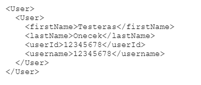

# Convert Diacritics to ASCII

\| [Recipes by Topic](../../readme.md ) \| [Recipes by Author](../../author.md ) \| [Request Enhancement](https://github.com/SAP-samples/cloud-integration-flow/issues/new?assignees=&labels=Recipe%20Fix,enhancement&template=recipe-request.md&title=Improve%20escaped-do-some-code-thing-%20 ) \| [Report a bug](https://github.com/SAP-samples/cloud-integration-flow/issues/new?assignees=&labels=Recipe%20Fix,bug&template=bug_report.md&title=Issue%20with%20escaped-do-some-code-thing-%20 ) \| [Fix documentation](https://github.com/SAP-samples/cloud-integration-flow/issues/new?assignees=&labels=Recipe%20Fix,documentation&template=bug_report.md&title=Docu%20fix%20escaped-do-some-code-thing-%20 ) \|

 | [Belinda Lineman](https://github.com/BelindaLineman ) |
----|----|

two-sentence-description-of-the-value-add-of-the-recipe

[Download the integration flow Sample](zip-file-name.zip)\


## Recipe

Step|Code|Why?
----|----|----
Import all required libraries | ```single-line-of-code``` | optional-short-explanation |
Get the message body | ```single-line-of-code``` | optional-short-explanation |
Remove the diacritics |  |optional-short-explanation |

### Related Recipes
* [upstream-recipe-name](../upstream-recipe-folder-name)\
* [alternate-recipe-name](../alternate-recipe-folder-name)

## References
* [title-of-blogs](http-link)\
* [title-of-Specs](http-link)\
* [title-of-html-page](http-link)

## Sample integration flow
describe-the-flow-of-the-integration-flow\


### Sample Script
This is the script used in this sample\
```
import com.sap.gateway.ip.core.customdev.util.Message;
import java.nio.charset.StandardCharsets;
import java.util.HashMap;
import java.text.Normalizer;
import java.text.StringUtils;
import org.apache.commons.lang3.StringUtils;

def Message processData(Message message) {
  def body = message.getBody(java.lang.String)
  def body1 = StringUtils.stripAccents(body);
  message.setBody(body1);
      return message
}
 ```

### Sample Input
Description-of-the-input-file\


### Sample Output
Description-of-the-output\

